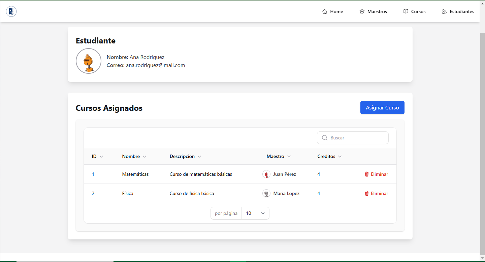
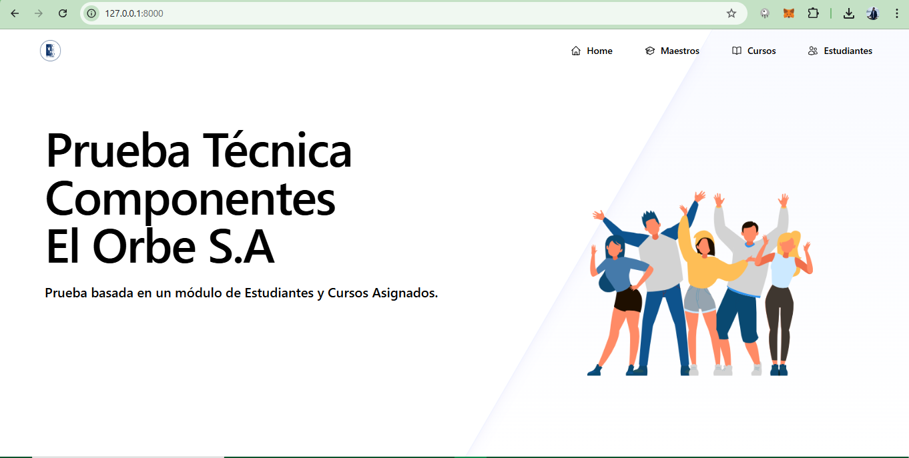
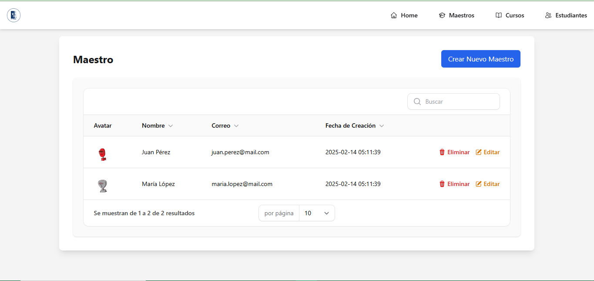
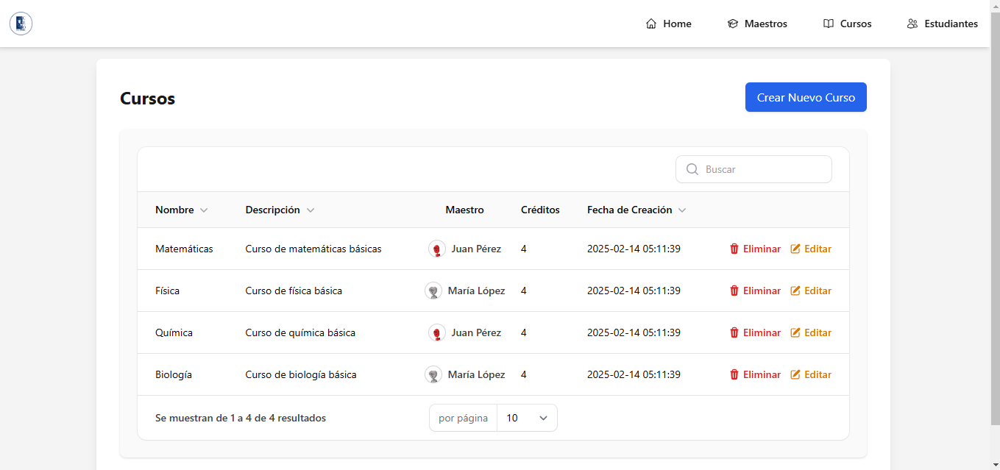
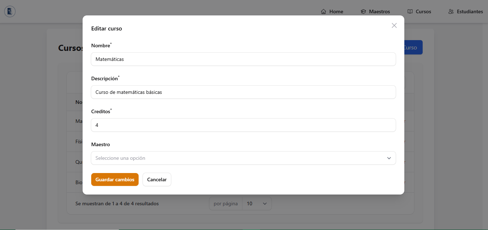
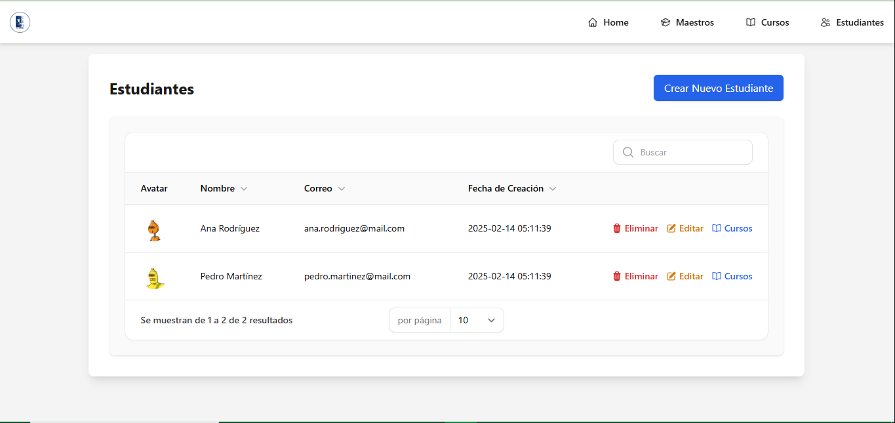

# 📚 Sistema de Gestión de Estudiantes

Este proyecto es una aplicación web para gestionar estudiantes y sus cursos utilizando **Laravel**, **Livewire**, **Alpine.js** y **Tailwind CSS**. Permite la creación, edición, eliminación y visualización de estudiantes con asignación de cursos en una interfaz interactiva y sin recargar la página.

## 🚀 Tecnologías Utilizadas

- **Laravel** - Framework backend en PHP
- **Livewire** - Framework para componentes dinámicos en Laravel
- **Alpine.js** - JavaScript ligero para interactividad
- **Tailwind CSS** - Framework CSS para estilos modernos y responsivos
- **MySQL** - Base de datos relacional

## Requisitos

- PHP 8.0 o superior
- Composer
- Node.js y npm (para la parte de frontend y construcción de assets)

## ⚙️ Instalación y Configuración

### 1. Clonar el repositorio

Clona este repositorio en tu máquina local:

```bash
git clone https://github.com/axelgolin4/Colegio.git
```

### 2. Instalar dependencias de PHP

Navega al directorio del proyecto y ejecuta el siguiente comando para instalar las dependencias de PHP:

```bash
cd Colegio
composer install
```

### 3. Instalar dependencias de frontend

Para la parte de frontend, instala las dependencias utilizando npm:

```bash
npm install
```

### 4. Configurar el entorno

Copia el archivo .env.example y renómbralo como .env:

```bash
cp .env.example .env
```

Configura los parámetros de la base de datos en el archivo .env según tu entorno. Para MySQL, por ejemplo:


```bash
DB_CONNECTION=mysql
DB_HOST=127.0.0.1
DB_PORT=3306
DB_DATABASE=colegio
DB_USERNAME=root
DB_PASSWORD=
```


### 5. Generar la clave de la aplicación

Ejecuta el siguiente comando para generar la clave de la aplicación:

```bash
php artisan key:generate
```


### 6. Ejecutar migraciones, seed y poblar la base de datos

Para crear las tablas en la base de datos, ejecuta las migraciones:

```bash
php artisan migrate --seed
```

### 7. Levantar el servidor de desarrollo

Finalmente, para levantar el servidor de desarrollo, ejecuta:

```bash
php artisan serve

npm run dev
```









